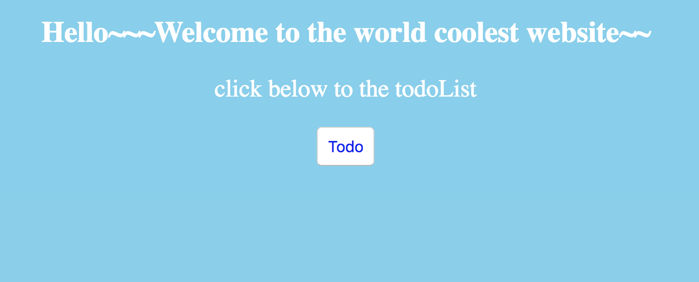
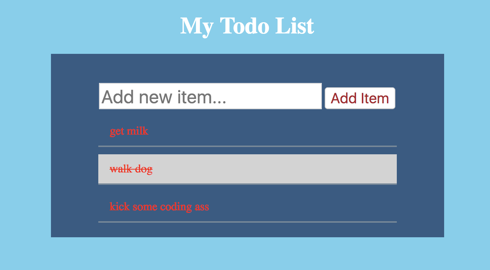

# node.js_express_mogoose_one
node.js + express + mogoose little todoList demo

If you want to run this little demo, you should first pull it to your local directory, and run npm install to install relative dependencies, finally you can run nodemon app, and that's it.

One important thing is you also install nodemon globally, you can run npm install nodemon -g.And in this way, you can use it wherever you want.

Have a look~~~~
If you like, give me a star~~~ ^_^

